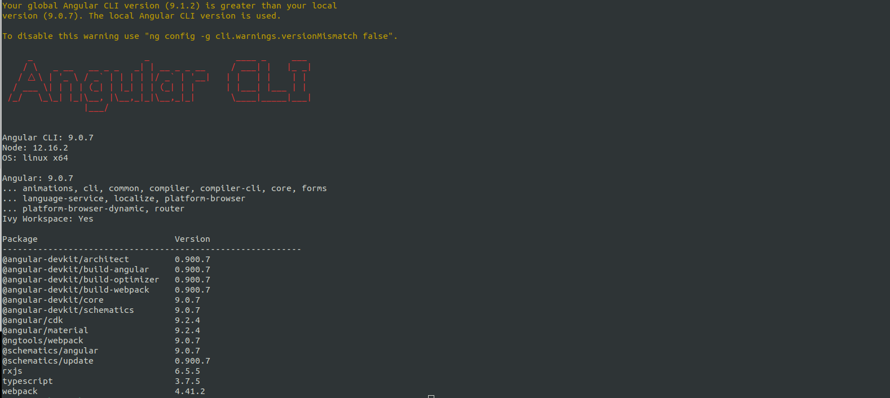

# Eapplication

# Linux

## Prérequis

### **Instalation du node js**

```console
$ sudo apt update
```

```console
$ sudo apt install nodejs
```

```console
$ sudo apt install npm
```

**_Pour vérifier_**

```console
$ nodejs --version
```

output: 6.14.7

```console
$ npm --version
```

output: v8.10.0

### **Instalation du Angular**

```console
$ npm install -g angular-cli
```

**Pour vérifier**

```console
$ ng version
```

output:


### **Instalation du flask**

```console
$ pip install Flask
```

Output:

Python 3.6.9

Flask 1.1.2

Werkzeug 1.0.1

### **Instalation du neo4j**

Télécharger `neo4j`: <a href="https://neo4j.com/download/">https://neo4j.com/download/</a>

Donner des droit d'éxecution

```console
$ chmod a+x neo4j-desktop-1.4.1-x86_64.AppImage
```

et lancer le

```console
$ ./neo4j-desktop-1.4.1-x86_64.AppImage
```

## Lancement de l'application

## neo4j

**Au premier démarrage**

Créer un Projet dans `neo4j` en cliquant sur `new` avec un nom (Eapplication par exemple)


Puis ajouter une base de données en cliquant sur `add` et donner un nom à la base de données (JexDeMots par exemple)
Après avoir créer la base de données lancer la sur `start`, si l'editeur ne s'ouvre pas vous pouvez l'ouvrir en cliquant sur `open`

Enfin dans la partie `connected as` ajouter un `user`, `:server add user` donner le nom `basil` comme `username` et `password` pour `password`


Pour une utilisation ultérieure il suffit de lancer juste la base de données sur `start`

## Angular

**Au premier démarrage**
Dans la repértoire `Eapplication/projet-eapp`

```console
user@foo:~/Eapplication/projet-eapp$ npm install
```

**Lancement du Angular**

```console
user@foo:~/Eapplication/projet-eapp$ npm run start
```

## Serveur

Dans la repértoire `Eapplication/server`
Créer une variable d'environnement

```console
$ export FLASK_APP=main
```

Lancer `Flask`

```console
$ flask run
```
